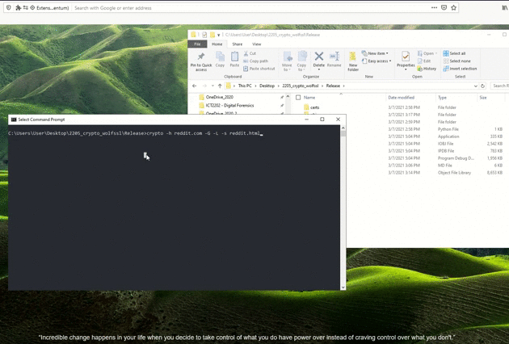

# ⚡ Loading code up on Visual Studio
- Launch wolfssl.sln at root folder with Visual Studio. The codes are within *crypto* project.

# ✨ Functionalities
1. Manual verification of two certs. 
2. Printing of desired cert details (Modulus and Exponent included).
3. Option to print peer cert details when established connection.
4. Sending of GET & POST messages to peer with SSL (peer certs are verified against our CA Certs from https://wiki.mozilla.org/CA).
5. User able to craft their own GET & POST parameters to send to peer.
6. :star2: Able to follow website redirect response. Complaint to https://en.wikipedia.org/wiki/HTTP_location

# 🔥 Structure
Files within in *crypto* project.

| Filename | Description |
| --- | --- |
| argparse.h | Contains function to parse user input from main and toggle different modes. |
| callback.h | Contains peer verification callback function to print peer certs details. |
| certfields.h | Contains all the helper functions which will be used for parsing PEM certs. Printing of public key information, cert fields & of public key’s N & E can be conducted using those functions. |
| common.h | Helper functions for conducting C stuffs. Strings comparison, copying and slicing, etc. |
| globals.h | Contains macros, definitions return codes, used throughout the whole program. |
| requests.h | Contains helper functions which utilizes wolfSSL_read and wolfSSL_write to interact with server/website using GET/POST messages. |
| verify.h | Contains all required functions which will be used for verifying peer certs. 
| main.c | Main program. (All procedures are here). Contains our own GET/POST msg builder. |

# 🛠️ Usage
1. On your windows command prompt, navigate to:
> Release/
2. A crypto.exe should have be compiled for you. You can build yourself if you want with VSS.
3. Execute it using command prompt. To view the help menu, type `crypto.exe -?`
<pre>
-v              Verify cert manual mode (using CertManager), please specify -C and -V certs.
-p [path]       Loads cert from [path] and display key details (With M & E inclusive)
-h [hostname]   Host to connect to, for e.g. youtube.com
-G [params]     Sends GET crafted message from params. For example sch=sit&name=luliming. Concat with '&' symbol.
-P [params]     Sends POST crafted message from params. For example sch=sit&name=luliming. Concat with '&' symbol.
-C [path]       CA cert file [path] to verify intermediate cert.
-V [path]       Intermediate cert file [path] to be verified by CA cert specified.
-s [path]       File path of where server's response using GET/POST will be saved into.
-a [request header] Additional request header, delimit using '&' E.g. "Connection: close&Content-Length: 0"
-S 		Prints peer cert details when connected to them.
-L              Follows redirect until receive HTTP 200 response.
</pre>

## ❄️ Examples
### Printing cert details
`➜ crypto.exe -p "./certs/youtube/youtube-root.pem"`

### Verify cert
`➜ crypto -v -C "./certs/youtube/youtube-root.pem" -V "./certs/youtube/youtube-mid.pem"`

### Sending messages GET/POST via SSL
#### Default (Requests for root path)
`➜ crypto.exe -h youtube.com -G` 

#### Saving response to file
`➜ crypto.exe -h reddit.com -G -s "reddit-page.html"`

#### Follow redirects mode
`➜ crypto.exe -h reddit.com -G -L`

#### Combining with saving response to html so you can view the output!
`➜ crypto.exe -h reddit.com -G -L -s "reddit-redirected.html"`

#### Parameters usage
`➜ crypto.exe -h youtube.com/results -G search_query=ihate+school`

#### Sending POST message via SSL
`➜ crypto.exe -h "www.allforyou.sg/login" -P "Email=test@test.com&Password=pass" -a "content-length: 0"`

# 🍀 Output
## Help Menu

## Printing Certificate Details
Printing all certificate details including modulus and exponent of pub key based on the certificate file path input.

## Manual verification of certifications
CA verify -> Intermediate

Intermediate verify -> leaf cert

## Example of Using GET without Redirect Functionality

## Example of Using GET with Redirect Functionality
As we can see from the above image, without using the redirect functionality, if a webpage has been moved permanently  
we are unable to follow the redirect. Hence, utilising the '-L' option, we are able to send multiple GET/POST to  
follow the redirection.  

## Callback Function
Connect and print all peer certification details using the callback function.

## Save HTML output
Connect to peer and save the HTML output to a file to render it on a browser

## Viewing the saved HTML output

# 🎶 Important functions
Key functions to look at:

| File | Functions |
| --- | --- |
| main.c | new_session, start_session, craft_redirect_msg, get_hostname_from_url, build_msg_header |
| verify.h | cert_manual_verify |
| certfields.h | print_peer_details, show_pkey_details, show_x509_bio_info, show_x509_pub_key_info, show_x509_name_info, show_x509_info |
| requests.h | client_read, client_write |

The codes are commented heavily to facilitate understanding of the whole code structure. Check [here](#-structure) to know where to mark! 

